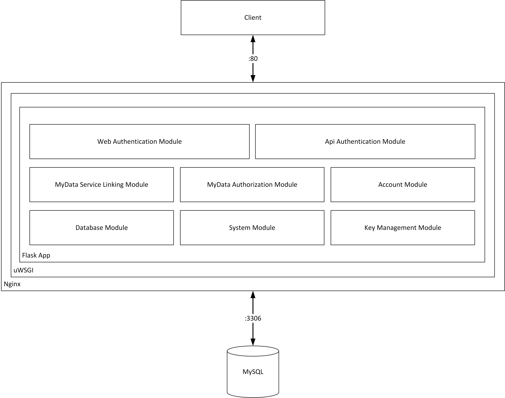

# Detailed Documentation
- [Deployment](deployment.md)
- [API documentation](api/)
- [Database documentation](database/)
- [Developer one-liners](developer_oneliners.md)

# MyData Account modules
## Service Linking
Service module (mod_service) provides implementation to fulfill requirements of MyData Service Linking Specification.

## Authorization
Authorization module (mod_mod_authorization) provides implementation to fulfill requirements of MyData Authorization Specification.

## Key Management
Key Management module (mod_blackbox) provides key management services for MyData Account.

## Database
Database module (mod_database) provides database integration for MyData Account.

# Architecture
High level description of MyData Account Architecture

